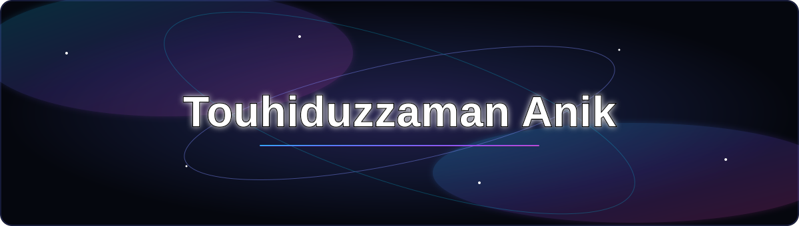

  

---

<h2 align="center">ABOUT ME</h2>

  Software Engineering student at
  <b>Daffodil International University</b>,
  passionate about software Design,Explore Artificial Inteligence and Robots

  
  
  

  I enjoy learning new technologies, improving my
  programming skills, and turning ideas into practical projects.

<h2 align="center">Tech Stack & Tools</h2>

<h3 align="center">Programming Languages</h3>

  

<h3 align="center">Development Tools</h3>

  

<h3 align="center">Web & Database</h3>

  

<h2 align="center">GitHub Analytics</h2>

  
  

  

  <i>Learning every day. Building one project at a time.</i>

# Connect with Me

  
  
  
  

- 🌐 **LinkedIn:** [Touhiduzzaman Anik](https://www.linkedin.com/in/touhiduzzaman-anik-5a599b32a)
- 💻 **Competitive Programming:** Active on Codeforces

  

